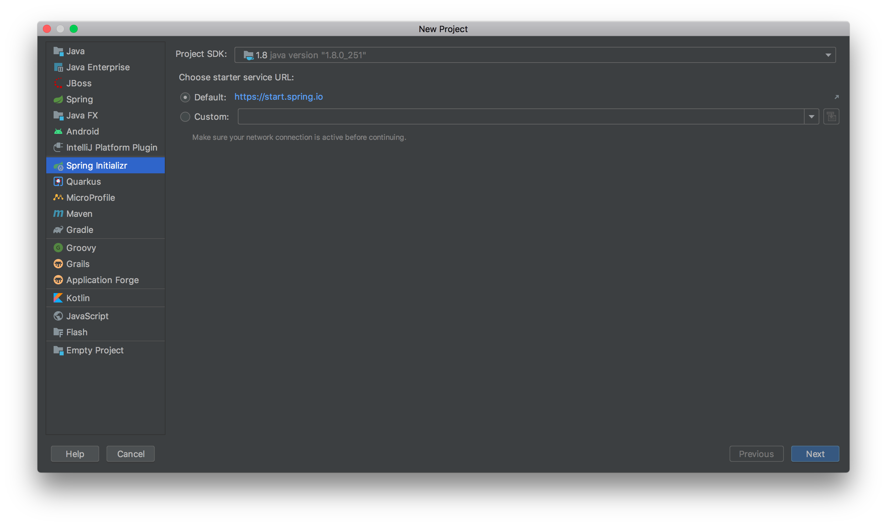
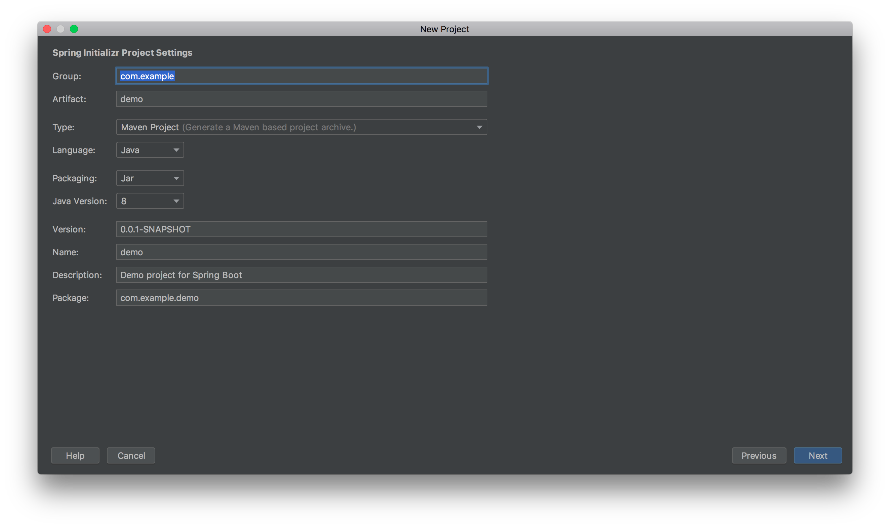
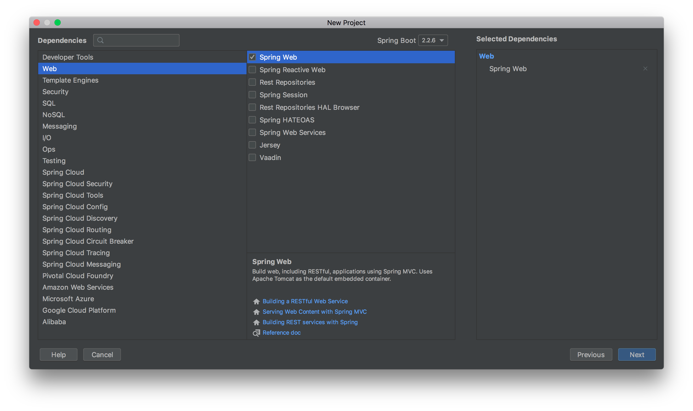
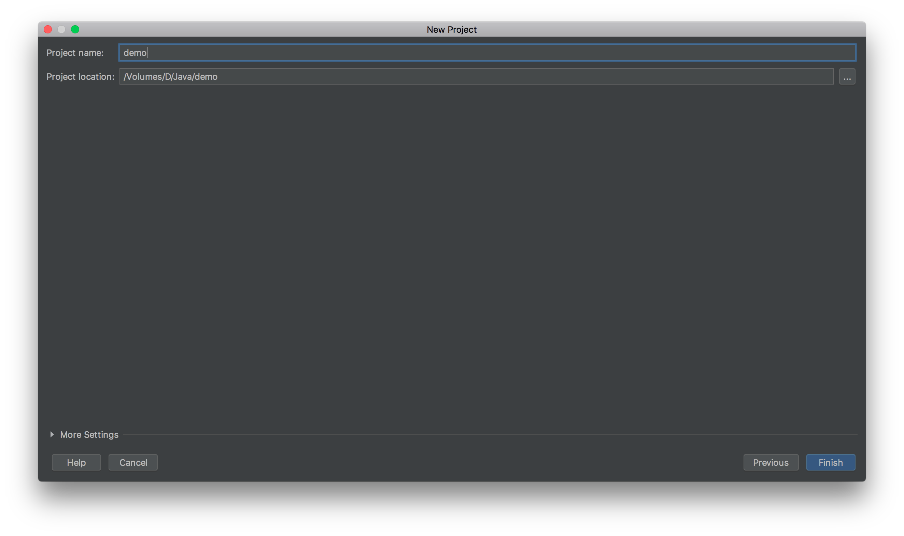

## 创建SpringBoot项目









创建一个Controller类

```java
package com.oyzc.luckmoney;

import org.springframework.web.bind.annotation.GetMapping;
import org.springframework.web.bind.annotation.RestController;

@RestController
public class HelloController {

    @GetMapping("/hello")
    public String say() {
        return "springboot";
    }
}
```

IDEA启动项目

### 使用命令打包成jar包启动项目

进入项目目录，执行如下命令打包，在target目录下会生成jar文件

>  mvn clean package

使用命令启动

> Java -jar target/文件名

### 配置

在application.properties修改端口，项目路径

```xml
server.port=8081
server.servlet.context-path=/luckymoney
```

(推荐写法)新建一个application.yml文件

```xml
server:
  port: 8081
  servlet:
    context-path: /luckymoney
```

可以在文件中配置变量

```xml
minMoney: 1
maxMoney: 200
description: 最少发${limit.minMoney}元，最多${limit.maxMoney}元
```

在类中使用注解获取变量

```java
@Value("${minMoney}")
private BigDecimal minMoney;
```

变量多可以使用对象配置

```xml
limit:
  minMoney: 1
  maxMoney: 200
  description: 最少发${limit.minMoney}元，最多${limit.maxMoney}元
```

创建一个limitConfog类，使用三个注解

```java
package com.oyzc.luckmoney;

import org.springframework.boot.context.properties.ConfigurationProperties;
import org.springframework.boot.context.properties.EnableConfigurationProperties;
import org.springframework.stereotype.Component;

import java.math.BigDecimal;

@Component
@EnableConfigurationProperties(LimitConfig.class)
@ConfigurationProperties(prefix = "limit")
public class LimitConfig {

    private BigDecimal minMoney;

    private BigDecimal maxMoney;

    private String description;

    public BigDecimal getMinMoney() {
        return minMoney;
    }

    public void setMinMoney(BigDecimal minMoney) {
        this.minMoney = minMoney;
    }

    public BigDecimal getMaxMoney() {
        return maxMoney;
    }

    public void setMaxMoney(BigDecimal maxMoney) {
        this.maxMoney = maxMoney;
    }

    public String getDescription() {
        return description;
    }

    public void setDescription(String description) {
        this.description = description;
    }
}
```

在Controller类中使用对象

```java
private LimitConfig limitConfig;

@Autowired
public void setLimitConfig(LimitConfig limitConfig) {
		this.limitConfig = limitConfig;
}
```

#### 开发环境的配置文件和生产环境不一样，可以这样配置

复制application.yml文件改为application-dev.yml(开发环境)

```xml
server:
  port: 8081
  servlet:
    context-path: /luckymoney

limit:
  minMoney: 0.01
  maxMoney: 200
  description: 最少发${limit.minMoney}元，最多${limit.maxMoney}元
```

复制application.yml文件改为application-prod.yml(生产环境)

```xml
server:
  port: 8081
  servlet:
    context-path: /luckymoney

limit:
  minMoney: 1
  maxMoney: 200
  description: 最少发${limit.minMoney}元，最多${limit.maxMoney}元
```

application.yml配置如下：

```xml
spring:
  profiles:
    active: dev
```

如果要不改变application.yml配置文件的情况下使用生产环境的配置

先打包成jar包

使用如下命令启动项目

> Java -jar -Dspring.profiles.active=prod target/文件名

| 注解            | 解释                                                         |
| --------------- | ------------------------------------------------------------ |
| @Controller     | 处理http请求                                                 |
| @RestController | Spring4之后新加的注解，原来返回json需要@ResponseBody配合@Controller |
| @RequestMapping | 配置url映射                                                  |

Restful风格 

```java
@GetMapping("/hello/{id}")
public String say(@PathVariable Integer id) {
		return "说明:" + limitConfig.getDescription();
}
```

如果是用/hello?id=100来传值

```java
@GetMapping("/hello")
public String say(@RequestParam("id") Integer id) {
		return "说明:" + limitConfig.getDescription();
}
```

不传ID会报错，怎么让ID不传也可以执行呢，required为false，加上默认值

```java
@RequestParam(value = "id", required = false, defaultValue = "0")
```

使用Post传值

```java
@PostMapping("/hello")
```

同样使用@RequestParam，不管是url传值还是body传值都可以识别到

```java
@RequestParam(value = "id", required = false, defaultValue = "0")
```

